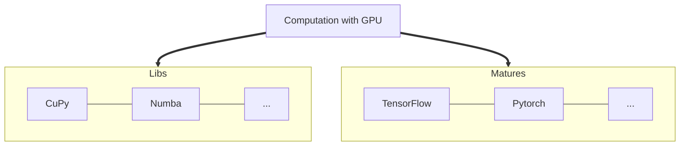

# GPU Usage



<div class="grid cards" markdown>

- :simple-nvidia:{ .lg .middle} **GPU Information** (1)
  { .annotate }

      1. using `#!bat nvidia-smi` to get the gpu information

      ---

      - :octicons-video-16: Model: NVIDIA A40
      - :octicons-video-16: Number of Graphic Cards: 2
      - :octicons-video-16: Size per cards: 48G
      - :octicons-video-16: Driver Version: 535.171.04
      - :octicons-video-16: CUDA Version: 12.2

      ---

  </div>

## CuPy

| :material-git:{ .mdx-heart } | Dependency                                         | Version                       |
| ---------------------------- | -------------------------------------------------- | ----------------------------- |
| :material-check:             | [Cupy](https://docs.cupy.dev/en/stable/index.html) | <!-- md:version 13.1.0 -->    |
| :material-check:             | Cuda ToolKit                                       | <!-- md:version 12.5.40 -->   |
| :material-check:             | cuDNN                                              | <!-- md:version 8.9.7.29 --> |
| :material-check:             | cuTensor                                           | <!-- md:version 2.0.1.2 -->   |
| :material-check:             | NCCL                                               | <!-- md:version 2.21.5.1 -->  |
| :material-check:             | numpy                                              | <!-- md:version 1.26.4 -->    |
| :material-check:             | python                                             | <!-- md:version 3.12.3 -->    |

!!! info

    To use CuPy
    ```bat
    conda activate Env_cupy
    ```
    ```python
    import cupy as cp
    ```
    To verify
    ```python
    print(cp.cuda.runtime.getDeviceCount())
    ```
    <div class="result" markdown>
    `>>> 2`
    </div>

## Numba

| :material-git:{ .mdx-heart } | Dependency                                                         | Version                    |
| ---------------------------- | ------------------------------------------------------------------ | -------------------------- |
| :material-check:             | [Numba](https://numba.pydata.org/numba-doc/latest/user/index.html) | <!-- md:version 0.59.1 --> |
| :material-check:             | numpy                                                              | <!-- md:version 1.26.4 --> |
| :material-check:             | python                                                             | <!-- md:version 3.12.3 --> |

!!! info

    To use Numba
    ```bat
    conda activate Env_numba
    ```
    ```python
    import numba
    ```
    To verify in python
    ```python
    numba.__version__
    ```
    <div class="result" markdown>
    `>>> '0.58.1'`
    </div>
    To verify in command
    ```bat
    numba -s/--sysinfo
    ```

## Pytorch

| :material-git:{ .mdx-heart } | Dependency                     | Version                        |
| ---------------------------- | ------------------------------ | ------------------------------ |
| :material-check:             | [Pytorch](https://pytorch.org) | <!-- md:version 2.3.1+cudaversion 12.5--> |
| :material-check:             | python                         | <!-- md:version 3.12.3 -->     |

!!! info

    To use Pytorch
    ```bat
    conda activate Env_pytorch
    ```
    ```python

    import torch
    ```
    To verify in python
    ```python
    torch.__version__
    ```
    <div class="result" markdown>
    `>>> '2.3.1'`
    </div>
    ```python
    torch.cuda.is_available()
    ```
    <div class="result" markdown>
    `>>> True`
    </div>
