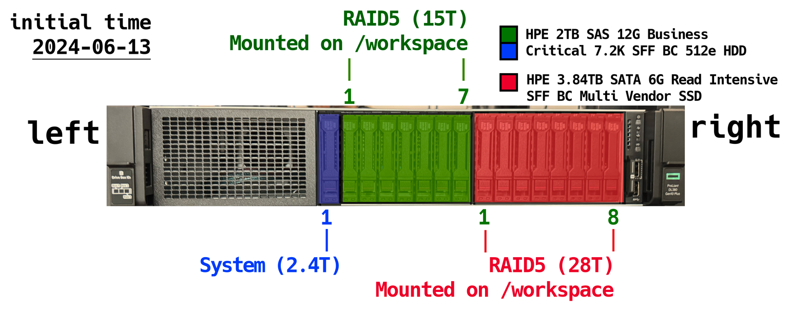

# Server Introduction

## Server

- :octicons-cpu-16:{ .lg .middle } **CPU Information** (1)
  { .annotate }

      1.  using `#!bat lscpu` to get the cpu information, and `#!bat nproc` to get the number of process units.

      ---

      - :material-clock-fast: Model: AMD EPYC 9654 @ 3.71 GHz
      - :material-clock-fast: Architecture: x86_64
      - :material-clock-fast: Number of process units: 384
      - :material-clock-fast: Threads per core: 2
      - :material-clock-fast: Cores per socket: 96
      - :material-clock-fast: Sockets: 2

      ---

- :simple-nvidia:{ .lg .middle } **GPU Information** (1)
  { .annotate }

      1. using `#!bat nvidia-msi` to get the gpu information

      ---

      - :octicons-video-16: Model: NVIDIA 5880 Ada
      - :octicons-video-16: Number of Graphic Cards: 8
      - :octicons-video-16: Size per cards: 48G
      - :octicons-video-16: Driver Version: 570.86.15
      - :octicons-video-16: CUDA Version: 12.8

      ---

- :material-harddisk:{ .lg .middle } **Storage Information** (1)
  { .annotate }

      1. using `#!bat df -h` to get the disk storage information

      ---

      - :fontawesome-solid-floppy-disk: system on 3.78T SSD with 1T RAM
      - :fontawesome-solid-floppy-disk: workspace1 on 21T SSD (RAID5)

      ---

  

??? tip "Detailed Disk Configuration"
    

    {width="1000"}
    

## Server Account

Please contact [Jesse](mailto:jessellyu@ust.hk) to request your server account.
