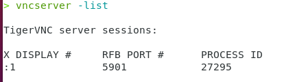
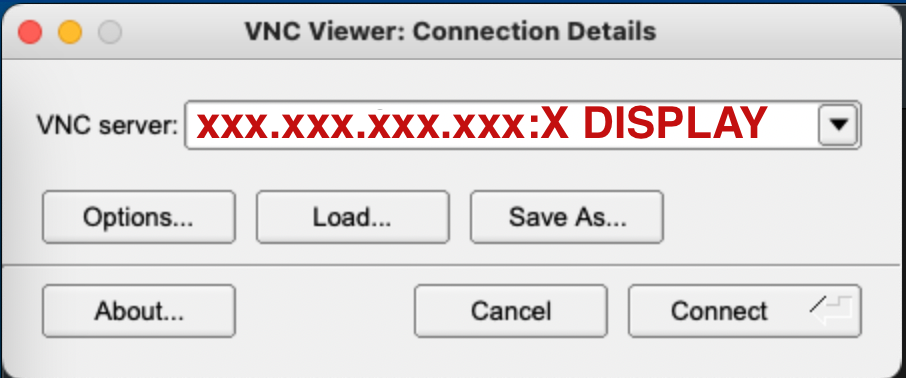
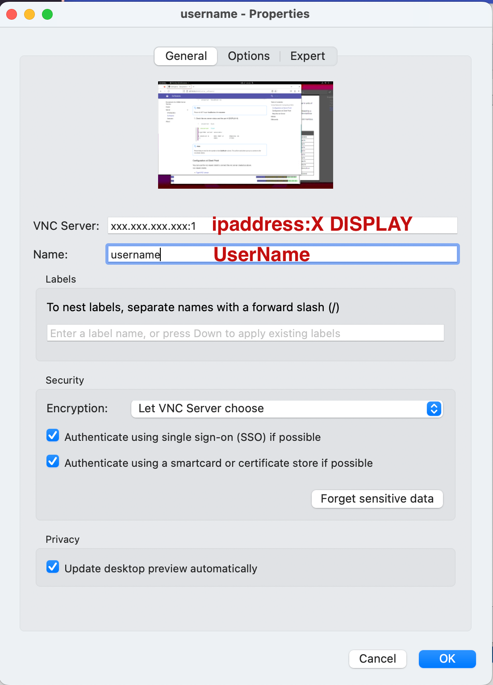
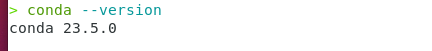

# Softwares on Climet server

| :heart:{ .mdx-heart } | Software                           | Discription                                                                        | Version                                                   |
| --------------------- | ---------------------------------- | ---------------------------------------------------------------------------------- | --------------------------------------------------------- |
| :material-check-all:  | [**VNC**](#vnc)                    | [Virtual Network Computing](https://tigervnc.org)                                  | <!-- md:version 1.12.0 --> installed by apt               |
| :material-close-box:  | [**Matlab**](#matlab)              | [HKUST acadamic license](https://download.ust.hk/apps/site/info/matlab2023a.html)  | <!-- md:version 2024a --> installed by iso                |
| :material-check-all:  | [**Miniconda**](#miniconda)        | [Python Env. Manager](https://docs.conda.io/projects/miniconda/en/latest/)         | <!-- md:version V24.4.0 --> installed by cml/wget         |
| :material-close-box:  | [**FileZilla**](#filezilla)        | [Ftp clinet](https://filezilla-project.org/)                                       | <!-- md:version V3.67.0 --> download from website         |
| :material-check-all:  | [**Adobe Creative Cloud**](#Adobe) | [Adobe creative cloud](https://www.adobe.com/hk_en/creativecloud.html)             | <!-- md:version V2024 -->                                 |
| :material-close-box:  | VSCODE                             | [IDE for Coding](https://code.visualstudio.com)                                    | <!-- md:version V1.90.0 --> installed by apt install .deb |
| :material-close-box:  | Java                               | [Java-jdk](https://ubuntu.com/tutorials/install-jre#2-installing-openjdk-jre)      | <!-- md:version 11.0.23  --> installed by apt             |
| :material-close-box:  | Panoply                            | [netCDF, HDF, GRIB Data Viewer](https://www.giss.nasa.gov/tools/panoply/download/) | <!-- md:version V5.4.1 --> download from website          |
| :material-close-box:  | Latex(texlive-full)                | [Typesetting program](https://www.tug.org/texlive/)                                | <!-- md:version TeX Live 2019/Debian -->                  |
| :material-check:      | Python3                            | [https://www.python.org/downloads/](https://www.python.org/downloads/)             | <!-- md:version V3.12.3 --> preinstalled with OS          |
| :material-check:      | Xterm                              | [https://invisible-island.net/xterm/](https://invisible-island.net/xterm/)         | <!-- md:version XTerm(392) --> installed by brew          |
| :material-check:      | Zsh                                | [Z shell](https://github.com/ohmyzsh/ohmyzsh/wiki/Installing-ZSH)                  | <!-- md:version V5.9 --> installed by brew                |
| :material-check:      | Oh-My-Zsh                          | [https://ohmyz.sh](https://ohmyz.sh)                                               | <!-- md:version master (a17789e) --> installed by curl    |
| :material-check:      | TMUX                               | [https://github.com/tmux/tmux/wiki](https://github.com/tmux/tmux/wiki)             | <!-- md:version V3.4 --> installed by brew                |
| :material-check:      | Neovim                             | [Uplevel VIM](https://neovim.io)                                                   | <!-- md:version V0.10.0 --> installed by brew             |
| :material-close-box:  | Node                               | [https://nodejs.org/en](https://nodejs.org/en)                                     | <!-- md:version V22.2.0 --> installed by brew             |
| :material-close-box:  | NPM                                | [https://www.npmjs.com](https://www.npmjs.com)                                     | <!-- md:version V10.7.2 --> installed by brew with node   |
| :material-close-box:  | Fish                               | [Fish shell](https://fishshell.com)                                                | <!-- md:version V3.7.1 --> installed by brew              |
| :material-check:      | Eza                                | [https://the.exa.website](https://the.exa.website)                                 | <!-- md:version V0.18.17 --> installed by brew            |
| :material-check:      | Homebrew                           | [https://brew.sh](https://brew.sh)                                                 | <!-- md:version V3.3.5 --> installed by curl              |

!!! info
    To use the most of softwares. Please export the path to the `.bashrc` file in
    your home path.
    `bat
    export PATH="/home/linuxbrew/.linuxbrew/bin:$PATH"
    `

## [Virtual Network Computing (VNC)](#vnc)

### Configuration at Server Point

1 Log in the server using `#!bat ssh` command on your local computer:

```{ .yaml .no-copy}
ssh [username]@[xxx.xxx.xxx.xxx server ip address]
```

2 Set the password for the vnc connection on your local computer:

```bat
vncpasswd
```

3 Start the vnc server:

```bat
vncserver -localhost no
```

4 Check the vnc server status and the port # (DISPLAY #):

```bat
vncserver -list
```

<div class="result" markdown>
{width="300"} 
</div>

!!! note \* **DO NOT** forget **_-localhost no_** after vncserver in step 3 \* **KEEP** in mind for the number in the **_X DISPLAY_** column.
This will be used when you try to connect to the vncviewer clients.

### Configuration at Client Point

You can use the vnc viewer client to connect the vnc server created as above. <br>
vnc viewer clients <br>

- [TigerVNC viewer](https://tigervnc.org)
<div class="grid" markdown>
Input your VNC server address plus the "X DISPLAY #"
Afterwards, you are required for the password to connect.

{width="300"}

</div>

- [RealVNC viewer](https://www.realvnc.com/en/)
<div class="grid" markdown>
Input your VNC server address plus the "X DISPLAY #" and your prefered
identification (Name). Afterwards, you are required for the password to connect.

{width="300"}

</div>
!!! note 
    * Refer to ***X DISPLAY*** in step 4 
    * Refer to ***Password*** in step 2

### Stop the vnc Server

If you want to stop vnc server, you just kill the server via terminal command on your local computer. <br>
`vncserver -kill:*` <br>
'\*' is for all vnc servers; you can use number to kill a specific port.

## [Matlab](#matlab)

The Matlab path is `/usr/local/bin/matlab`  
Open the matlab via inputing cmd `#!bat matlab` in terminal

## [Miniconda](#miniconda)

The **_Miniconda_** has been installed on the server under the root account.
It can be used in the user account by adding exporting the path to the `.bashrc` file in
your home path `/home/.bashrc`

```bat
export PATH="/home/user/miniconda3/bin:$PATH"
```

??? tip
    After you export the path to the `.bashrc` file.
    You also need to restart the terminal and excute `#!bat source ~/.bashrc`.
    `bat
    conda --version
    `

    <div class="result" markdown>
    {width="300"}
    </div>

!!! note 
    - When you login the server using `#!cmd ssh`, you will get into `/home` path directly.
    You can find the `.bashrc` file via `#!cmd ls -a` command in the `/home` path. 
    - When you login the server using `vncviewer`, you can find the `.bashrc` file in the
    `Home` folder. Please note that `.bashrc` is a hided file in the `Home` folder.
    You can display hided files using shortcuts ++ctrl+h++.

## [FileZilla](#filezilla)

The ftp client (FileZilla) is installed in the server. You can open the FileZilla via inputing cmd `#!zsh filezilla` in terminal.

## [Adobe Creative Cloud](#Adobe)

The Adobe Creative Cloud provides us more tools (e.g. Photoshop, Illustrator, Acrobat) to conduct design-related works.
If you want to use these tools, please contact server managers.
