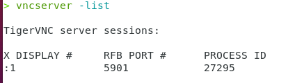

# Softwares on Climet Server

| Software     | Discription   | Version    |
| ------------ | ------------- | ------------ |
| [**VNC**](#vnc)| Virtual Network Computing| TigerVNC 1.13.0 |
| [**Matlab**](#matlab)| [HKUST acadamic license](https://download.ust.hk/apps/site/info/matlab2023a.html)  | Matlab 2023a |
| [**Miniconda**](#miniconda)| Python Env. Manager | V23.5.0 |

## [Virtual Network Computing (VNC)](#vnc)

### Configuration at Server Point
1 Log in the server using `#!bat ssh` command on your local computer:

```{ .yaml .no-copy}
ssh [username]@[xxx.xxx.xxx.xxx server ip address]
```

2 Set the password for the vnc connection on your local computer:

```bat 
vncpasswd
```

3 Start the vnc server:

```bat
vncserver -localhost no 
```

4 Check the vnc server status and the port # (DISPLAY #):

```bat
vncserver -list
```

<div class="result" markdown>
{width="300"} 
</div>

!!! note
    * **DO NOT** forget ***-localhost no*** after vncserver in step 3
    * **KEEP** in mind for the number in the ***X DISPLAY*** column.
      This will be used when you try to connect to the vncviewer clients.


### Configuration at Client Point

You can use the vnc viewer client to connect the vnc server created as above. <br>
vnc viewer clients <br>

+ [TigerVNC viewer](https://tigervnc.org)
<div class="grid" markdown>
Input your VNC server address plus the "X DISPLAY #"
Afterwards, you are required for the password to connect.

{width="300"}
</div>

+ [RealVNC viewer](https://www.realvnc.com/en/)
<div class="grid" markdown>
Input your VNC server address plus the "X DISPLAY #" and your prefered
identification (Name). Afterwards, you are required for the password to connect.

{width="300"}
</div>
!!! note 
    * Refer to ***X DISPLAY*** in step 4 
    * Refer to ***Password*** in step 2


### Stop the vnc Server
If you want to stop vnc server, you just kill the server via terminal command on your local computer. <br>
`vncserver -kill:*` <br>
'*' is for all vnc servers; you can use number to kill a specific port.

        
## [Matlab](#matlab)

The Matlab path is `/usr/local/bin/matlab`   
Get into the path and Run the matlab by inputing cmd `#!bat ./matlab` in terminal

## [Miniconda](#miniconda)

The ***Miniconda*** has been installed on the server under the root account.
It can be used in the user account by adding exporting the path to the `.bashrc` file in
your home path `/home/.bashrc`  

```bat
export PATH="/home/super/miniconda3/bin:$PATH"
```

??? tip
    After you export the path to the `.bashrc` file.
    You also need to restart the terminal and excute `#!bat source ~/.bashrc`.
    ```bat
    conda info
    ```
    <div class="result" markdown>
    {width="300"}
    </div>


!!! note
    * When you login the server using `#!cmd ssh`, you will get into `/home` path directly.
    You can find the `.bashrc` file via `#!cmd ls -a` command in the `/home` path.
    * When you login the server using `vncviewer`, you can find the `.bashrc` file in the
    `Home` folder. Please note that `.bashrc` is a hided file in the `Home` folder.
    You can display hided files using shortcuts ++ctrl+h++.


    
